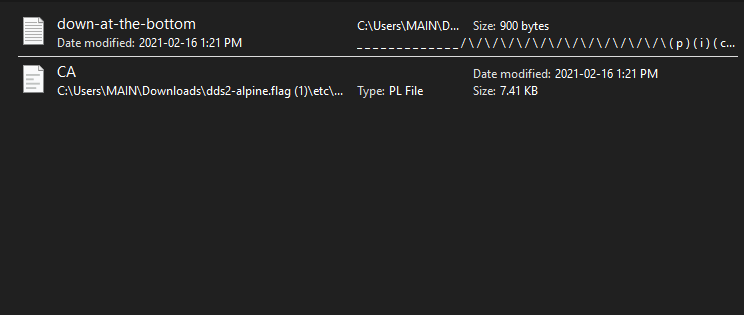

>All we know is the file with the flag is named "down-at-the-bottom.txt"... Disk image: dds2-alpine.flag.img.gz

First thing I did after downloading the file is unzipping using 7zip and after doing so a simple search for .txt and it returned this:

So obviously I asumed that the flag is in the "down-at-the-bottom.txt" file and opening the file gave me the flag which was the correct answer.

> picoCTF{f0r3ns1c4t0r_n0v1c3_82489dbf} 
