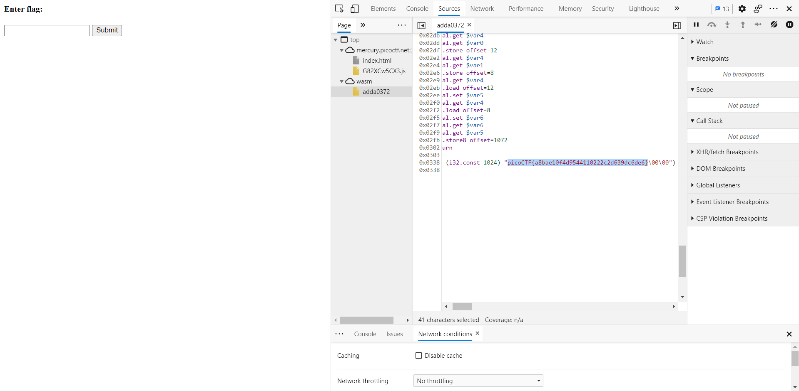

## Some Assembly Required 1

In this problem when you view the source code you will find that the flag is located in plain text at the bottom of the ".wasm' file

### Flag
`picoCTF{a8bae10f4d9544110222c2d639dc6de6}`
